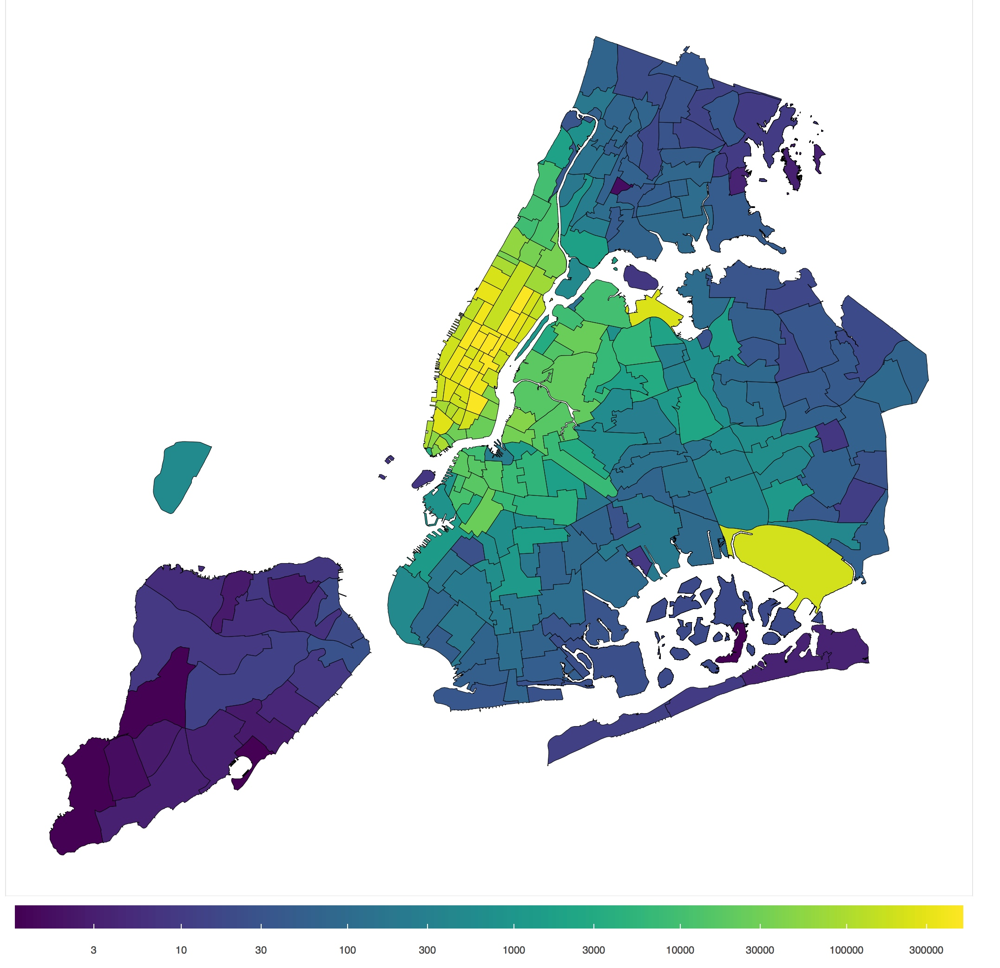
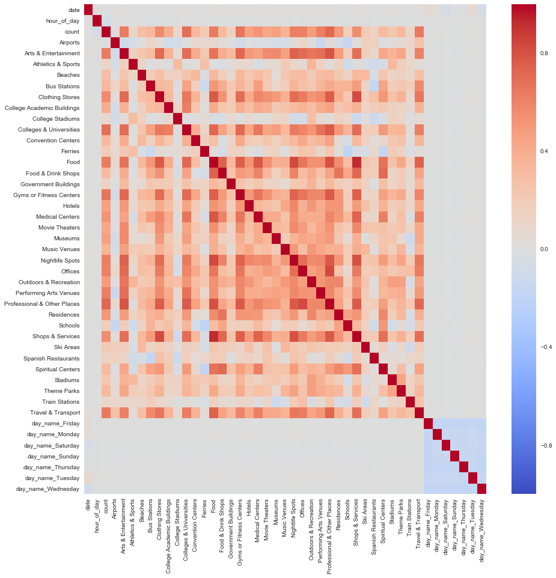

# NYC-Taxi-Demand-Prediction

- Built a Regression Tree based taxi demand prediction model to predict the number of taxis at a given space and time in NYC with 90% Rsquare performance
- Enhanced model's performance by adding novel taxi-demand relevant features from multiple open source datasets. Identified demand drivers using feature importance maps

# Code can not be uploaded yet. But, some visualizations from the project could be seen below

## Number of Pickup heatmap

## Correlation between variables

## Feature importance

